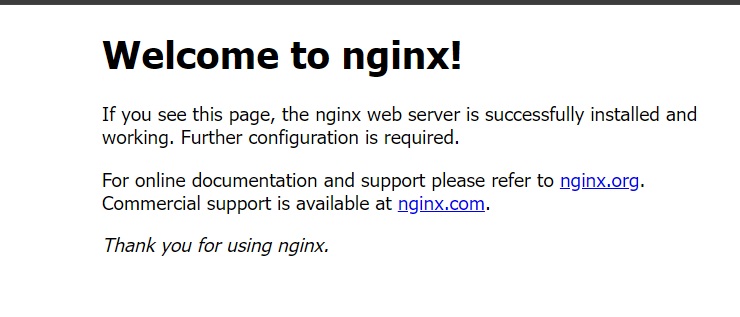
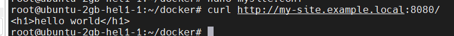

### Установка Docker
По документации:
https://docs.docker.com/engine/install/ubuntu/  
https://docs.docker.com/compose/install/linux/
for pkg in docker.io docker-doc docker-compose docker-compose-v2 podman-docker containerd runc; do sudo apt-get remove $pkg; done  

sudo apt update  
sudo apt upgrade docker.io docker-compose  
sudo apt-get update  
sudo apt-get install docker-compose-plugin  

mkdir docker  
cd docker

nano docker-compose.yml
```
version: '3'
services:
  nginx:
    image: nginx
    ports:
      - 8080:80
```
docker compose up -d
#Проверка
docker logs --tail 10 <container_id>

При обращении по адресу http://IP:8080/ видим такое сообщение:


docker run -d --restart always --name nginx1 -p 8080:80 -v /root/docker/html:/usr/share/html nginx:stable
### Смотрим на структуру проекта nginx, зайти внутрь контейнера
docker exec -ti nginx1 bash
Нашёл конфиг-файл и добавил его в volumes
```
services:
  nginx:
    image: nginx
    ports:
      - 8080:80
    volumes:
      - ./mysite.conf:/etc/nginx/nginx.conf
      - ./site/index.html:/usr/share/nginx/html/index.html
```
Теперь при обращении по адресу http://IP:8080/ видим свой html-файл:  


### Меняем конфигурационный файл (mysite.conf)
Дописываем туда данную секцию:
```
    server {
        listen 80;
        server_name my-site.example.local www.my-site.example.local;

        location / {
            root /usr/share/nginx/html;
            deny 192.168.10.0/24;
            allow all;
        }
    }

```
Так как у меня сервер с внешним IP, а доступ из Интернета закрыт, я отправлю запрос с помощью утилиты curl  
Пометка: IP и DNS адреса были связаны в файле /etc/hosts



