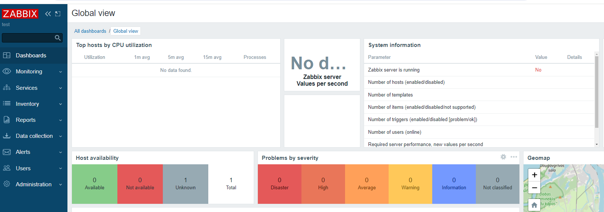
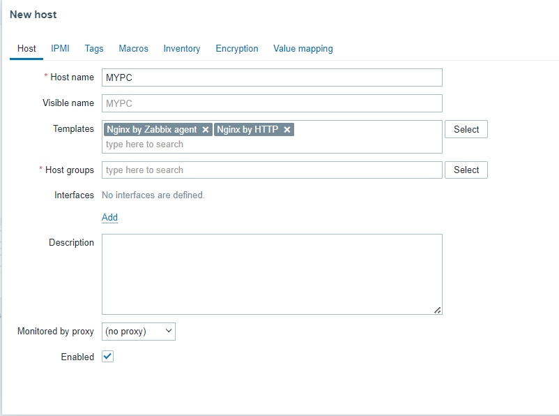
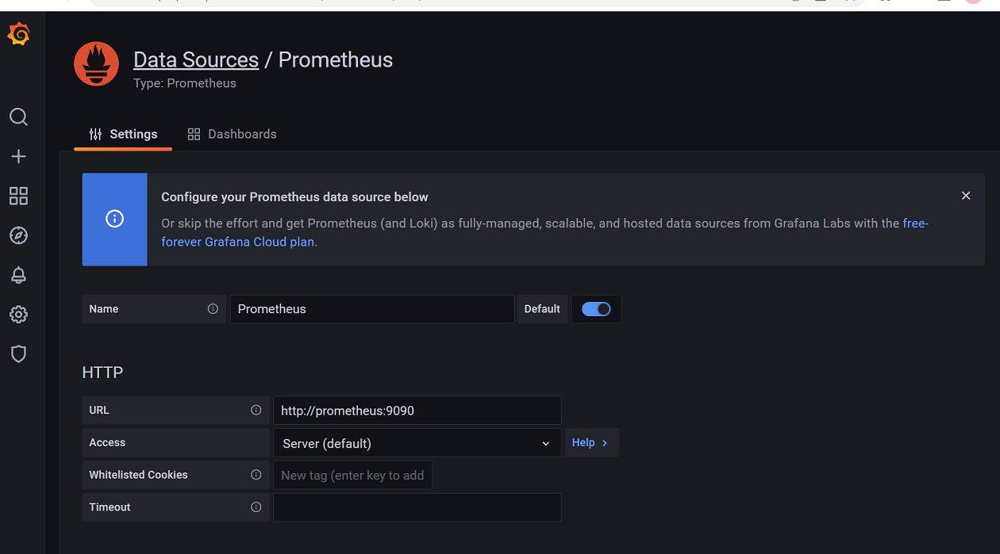
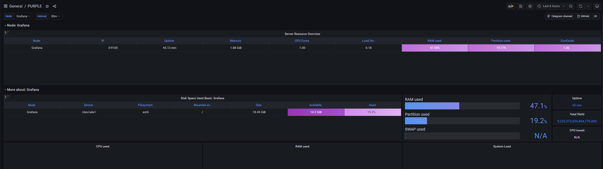

# Установка Zabbix + Nginx
документация:
https://www.zabbix.com/download

apt-get update
wget https://repo.zabbix.com/zabbix/6.4/ubuntu/pool/main/z/zabbix-release/zabbix-release_6.4-1+ubuntu24.04_all.deb  
dpkg -i zabbix-release_6.4-1+ubuntu24.04_all.deb  
apt update  
apt install zabbix-server-mysql zabbix-frontend-php zabbix-nginx-conf zabbix-sql-scripts zabbix-agent
sudo apt-get install mysql.server -y

mysql -uroot -p  
SomePwd123!!  
mysql> create database zabbix character set utf8mb4 collate utf8mb4_bin;  
mysql> create user zabbix@localhost identified by 'SomePwd123!!';  
mysql> grant all privileges on zabbix.* to zabbix@localhost;  
mysql> set global log_bin_trust_function_creators = 1;   
mysql> quit;  

systemctl restart mysql.service

zcat /usr/share/zabbix-sql-scripts/mysql/server.sql.gz | mysql --default-character-set=utf8mb4 -uzabbix -p zabbix  
SomePwd123!!

mysql -uroot -p  
SomePwd123!!  
mysql> set global log_bin_trust_function_creators = 0;  
mysql> quit;

nano /etc/zabbix/zabbix_server.conf
```
DBPassword=smt_pwd11!
```

nano /etc/zabbix/nginx.conf
```
# listen 8080;
# server_name example.com;
```

systemctl restart zabbix-server zabbix-agent nginx php8.3-fpm
systemctl enable zabbix-server zabbix-agent nginx php8.3-fpm

И итоге после успешной установки проходим по адресу в браузере и видим это: 


### Далее скачиваем и настраиваем Zabbix Agent 2 для Nginx



# Добавим Graphana (в Docker)
cd zabbix  
git clone https://github.com/Arsi44/docker_grafana_prometheus.git  
cd docker_grafana_prometheus  
docker-compose up -d  

Далее переходим на http://IP:3000/  
(пароль SomePwd123!!)  
И работаем по скринам
http://prometheus:9090

  
2. Data sources -> Import purple.json (хранится локально)

Далее правим конфиг файл  
rm -rf /var/lib/docker/volumes/docker_grafana_prometheus_prom-configs/_data/prometheus.yml  
nano /var/lib/docker/volumes/docker_grafana_prometheus_prom-configs/_data/prometheus.yml  

```
global:
  scrape_interval:     15s
  evaluation_interval: 15s

scrape_configs:
  - job_name: "node_exporter"
    static_configs:
    - targets: [localhost:9100]
      labels:
        label: "Grafana"
```
docker restart docker_grafana_prometheus_prometheus_1  
### Итог:
